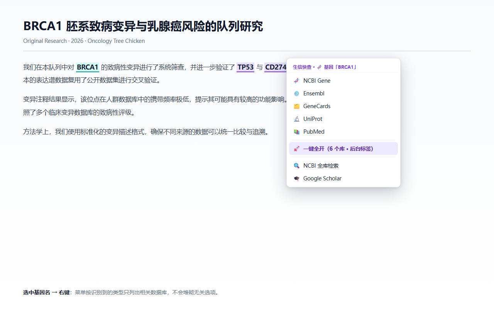
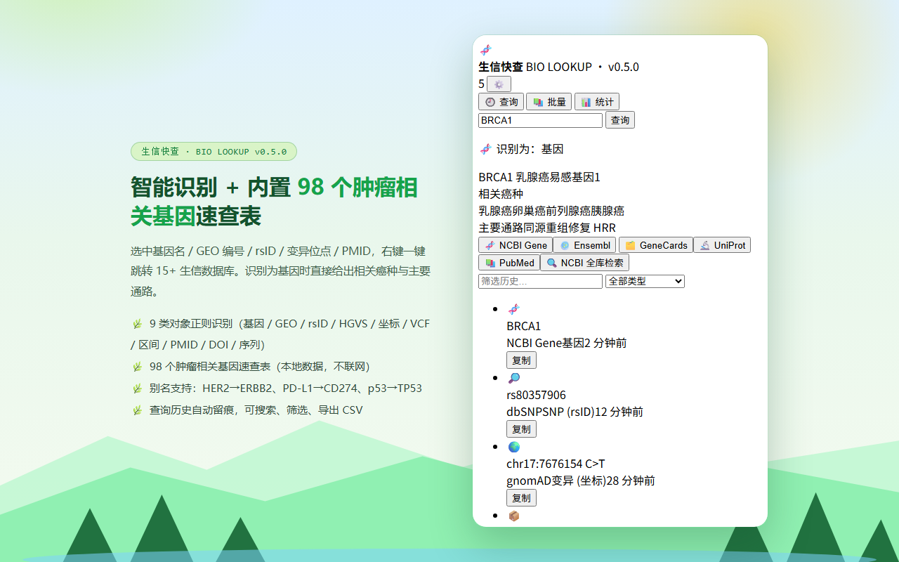
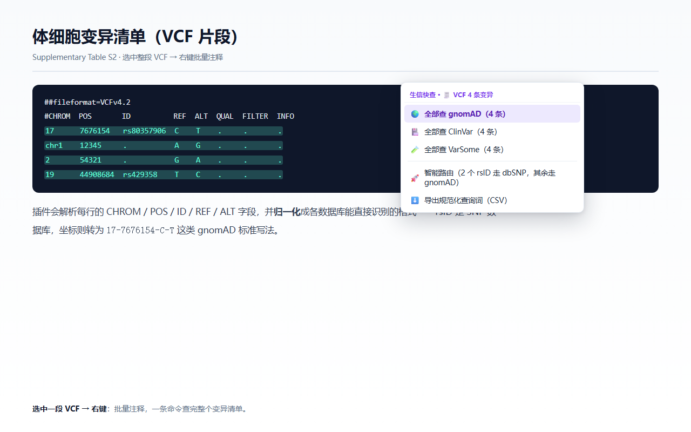
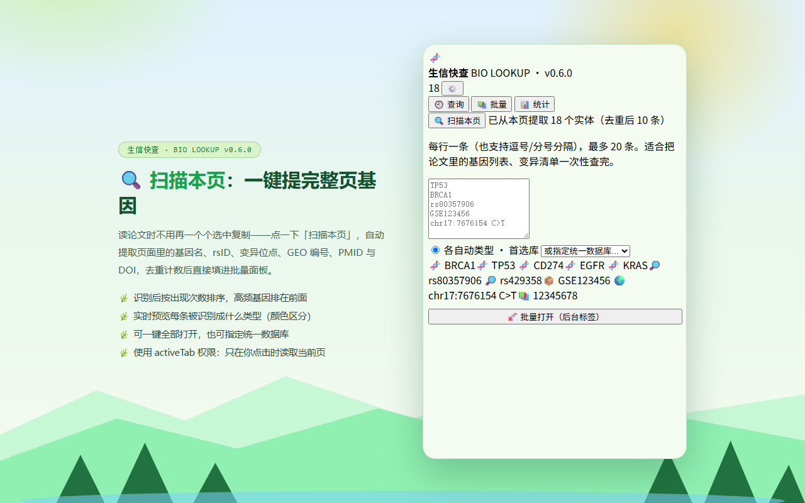
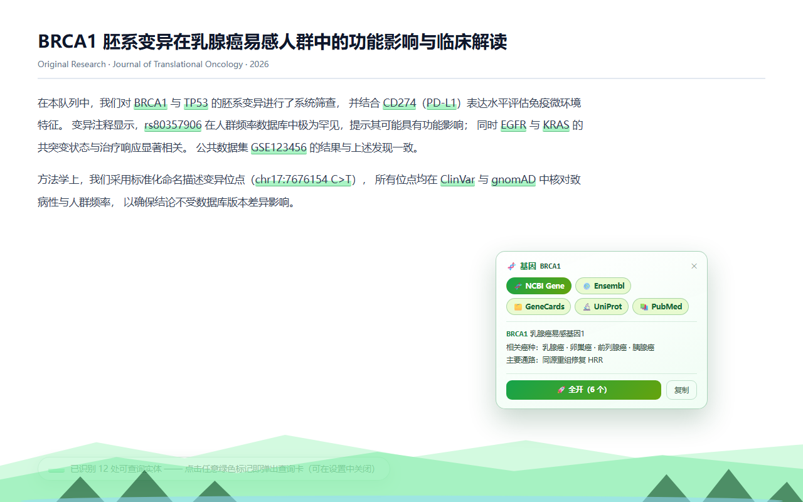
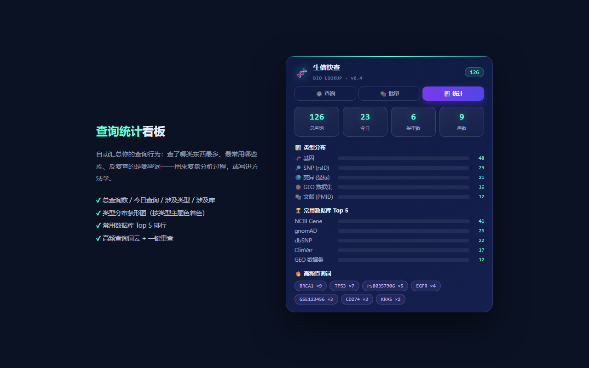

<div align="center">

# 🧬 Bio Lookup · 生信快查

**Select a gene, rsID, variant, GEO accession or PMID → right-click → jump to 15+ bioinformatics databases**

A browser extension for life-science & medical researchers · zero dependencies · does not read pages by default · no tracking

[](https://microsoftedge.microsoft.com/addons/detail/ORDCKFTQ6T96)
[](https://github.com/sushuqiong/bio-lookup-extension/releases/latest)
[](LICENSE)
[](tests/)
[](manifest.json)
[](https://github.com/sushuqiong/bio-lookup-extension/releases/latest)

[中文](README.md) · [**English**](README.en.md)



</div>

---

## 💡 The problem it solves

Every day in bioinformatics: **the same gene name copied and pasted between five databases.**

Look up `BRCA1` → GeneCards for cancers, NCBI Gene for the record, UniProt for the protein, PubMed for papers.
Look up `rs80357906` → dbSNP, gnomAD for frequency, ClinVar for pathogenicity….
Ten genes later you have a wall of tabs and no idea which is which.

**Bio Lookup turns that into: select → right-click → one click.**

---

## ⬇️ Install (30 seconds)

### Option 1 · Microsoft Edge Add-ons ✅ **(live, recommended)**

**👉 [Install from the Edge store](https://microsoftedge.microsoft.com/addons/detail/nppooifacggmmpmcapgpjengdbhpjcee)**

> ✅ One-click install · ✅ Auto-update · ✅ Survives restarts · ✅ No developer mode
>
> 💡 The extension name is displayed according to your browser language: "生信快查 · Bio Lookup" (zh) / "Bio Lookup" (en).

[](https://microsoftedge.microsoft.com/addons/detail/nppooifacggmmpmcapgpjengdbhpjcee)

### Option 2 · GitHub download (**works right now**)

1. **[Download the latest zip](https://github.com/sushuqiong/bio-lookup-extension/releases/latest)** (`bio-lookup-extension-vX.Y.Z.zip`)
2. **Unzip** it to a **permanent location** (e.g. `C:\Users\<you>\Extensions\bio-lookup`)
3. Open your extensions page: Edge → `edge://extensions` ｜ Chrome → `chrome://extensions`
4. Turn on **Developer mode** (Edge: bottom-left sidebar; Chrome: top-right)
5. Click **Load unpacked** → select the **unzipped folder** (not the zip)

> [!IMPORTANT]
> **Do NOT move, rename or delete the folder after loading.** The browser stores its **absolute path** — moving it makes the extension vanish (a reload is required).
>
> Requires desktop Chrome / Edge **116+**.

**Quick test**: open any page → select `BRCA1` → right-click → you should see the "Bio Lookup · gene BRCA1" menu.

---

## ✨ Highlights

| | Feature | What it does |
|---|---|---|
| 🔍 | **Scan this page** | Extract every gene / rsID / variant / GEO accession / PMID / DOI on the current page, de-duplicated and counted, straight into the batch panel |
| 🧠 | **9 recognised object kinds** | gene · GEO/SRA · rsID · HGVS variant · coordinate variant · VCF row · genomic region · PMID/DOI · nucleotide sequence |
| 🎯 | **Menu shows only relevant databases** | Selecting `rs80357906` lists variant databases only — no clutter |
| 🚀 | **Open all at once** | Variant curation needs frequency + pathogenicity + original record → up to 5 related databases in background tabs |
| 🧬 | **Built-in reference for 98 cancer-related genes** | Related cancers + main pathway, fully offline |
| 🖍️ | **In-page gene highlighting** (optional) | Gene symbols on any page get marked; click to open a lookup card |
| 🧾 | **VCF batch annotation** | Select a VCF block → coordinates normalised to the gnomAD format → batch query or CSV export |
| 📚 | **Batch query** | Paste a gene list from a paper; each entry routed to its primary database |
| 🔬 | **Sequence tools** | DNA → length / GC content / reverse complement / RNA transcript, one-click copy |
| 📊 | **Statistics + history** | Type distribution, top databases, frequent terms; searchable history with CSV export |
| 📗 | **Zotero integration** (optional) | Find a PMID/DOI in your local Zotero library |
| ⚙️ | **Custom databases** | Add any site with a `{q}` template, optionally limited to certain object types |

<details>
<summary><b>🖼️ All screenshots (6)</b></summary>

| Smart detection + gene reference | Right-click menu | VCF batch annotation |
|---|---|---|
|  |  |  |

| Scan this page | In-page highlighting | Query statistics |
|---|---|---|
|  |  |  |

</details>

---

## 🧬 Built-in quick reference (98 cancer-related genes, offline)

| Gene | Associated cancers | Main pathway |
|---|---|---|
| `BRCA1` | Breast · Ovarian · Prostate · Pancreatic | Homologous recombination repair (HRR) |
| `CD274` (PD-L1) | Pan-cancer immunotherapy marker · Lung · Gastric | Immune checkpoint |
| `CLDN18` | Gastric · Gastro-oesophageal junction | Adhesion / therapeutic target |
| `EGFR` | NSCLC · Colorectal · Glioblastoma | RTK / RAS / MAPK |
| `DPYD` | 5-FU / capecitabine toxicity | Drug metabolism |

Covers targeted therapy, immune checkpoints, MMR/HRR pathways and chemo-sensitivity genes.
Aliases supported: `HER2`→ERBB2, `PD-L1`→CD274, `p53`→TP53, `CLDN18.2`→CLDN18.

---

## 📊 Supported databases (15+)

| Category | Databases |
|---|---|
| 🧬 Genes | NCBI Gene · Ensembl · GeneCards · UniProt · NCBI Protein · PubMed |
| 🔎 Variants | dbSNP · ClinVar · gnomAD · VarSome · Franklin · UCSC Genome Browser |
| 📦 Datasets | GEO · SRA Run Selector · ArrayExpress |
| 📚 Literature | PubMed · Europe PMC · Google Scholar · Zotero (local) |
| 🚀 Sequence | NCBI BLAST |

---

## 🔒 Privacy

- **Does not read page content by default** — core features need only context menu + local storage
- Page reading (floating card / highlighting / scan) is **opt-in**; scanning uses `activeTab`, reading the page **only when you click the button**
- All data (history / settings / custom databases) stays **in your browser; nothing is uploaded**
- **No account, no analytics, no telemetry, no remote code**
- Privacy policy: <https://sushuqiong.github.io/bio-lookup-extension/privacy.html>

---

## 🧪 Tests

**169 automated tests**, all runnable offline (Node 18+):

```bash
node tests/classify.test.mjs           # 67 — detection / VCF parsing / URL building
node tests/genedata.test.mjs           # 26 — gene table / aliases / sequence tools
node tests/scan.test.mjs               # 21 — page scanning / highlight vocabulary
node tests/scanpage.sim.mjs            # 23 — "scan this page" message pipeline
node tests/background.sim.mjs          # 14 — background logic vs mocked Chrome API
node tests/background.bundle.sim.mjs   # 10 — single-file bundle behaviour
node tests/background.degraded.sim.mjs # 8  — graceful degradation when an API is missing
```

---

## ❓ FAQ

<details>
<summary><b>The right-click menu does not appear</b></summary>

1. Make sure the extension is enabled (`edge://extensions`)
2. Select some text first (the menu only shows for selections)
3. Open the settings page (click the icon → ⚙️) and press **"Recreate right-click menu"** — the page also shows menu diagnostics (created at / items / errors)

</details>

<details>
<summary><b>The extension disappeared after restarting the browser</b></summary>

Almost always because the **folder was moved / renamed / deleted** (the browser stores the absolute path).
Move it back, or re-unzip and load it again.

</details>

<details>
<summary><b>Floating card / highlighting does not work</b></summary>

Both are **optional** — enable and authorise them in the settings page, then **reload the page** so the content script is injected.
Browser-internal pages (`chrome://`), PDF viewers and the extension store are not supported by design.

</details>

<details>
<summary><b>It sometimes detects the wrong thing</b></summary>

Regex detection cannot be perfect (`COVID`, `MISSING` may look like gene symbols; 7–9 digit numbers may look like PMIDs).
Every menu therefore ends with generic fallback entries (NCBI all-database search / Google Scholar).

</details>

---

## ⚠️ Known limitations

- Regex detection cannot reach zero false positives (see above)
- Floating card / highlighting do not work on browser-internal pages, PDF viewers, or inside VS Code / Zotero embedded browsers
- Batch and VCF operations are capped at 15–20 items
- Zotero integration requires a local Zotero 7 instance with "allow other applications to communicate"

---

## 🛠️ Development & build

<details>
<summary><b>Project layout / how to rebuild</b></summary>

```
manifest.json          # MV3 manifest
classify.js            # type detection + database map (pure functions)
genedata.js            # type colours + 98-gene table + sequence tools + page entity extraction
background.js          # service worker source
background.bundle.js   # generated single-file worker (no ESM) — used by the extension
content.js             # floating card + in-page highlighting (injected on demand)
popup.html/css/js      # main panel (query / batch / statistics)
options.html/js        # settings (custom DBs, overlay, highlighting, menu repair)
build.py               # build script: regenerates background.bundle.js
tests/                 # 169 automated tests
docs/                  # GitHub Pages landing page + privacy policy + store assets
```

Rebuild the background bundle:

```bash
python build.py
```

</details>

<details>
<summary><b>Changelog</b></summary>

See [CHANGELOG.md](CHANGELOG.md)

</details>

---

## 📄 License & feedback

[MIT License](LICENSE) © 2026 sushuqiong

Questions, bug reports and feature requests: [**GitHub Issues**](https://github.com/sushuqiong/bio-lookup-extension/issues)

If it saves you time, a ⭐ **star** is much appreciated 🙌

<div align="center">

**Saving researchers one copy-paste at a time.**

</div>
