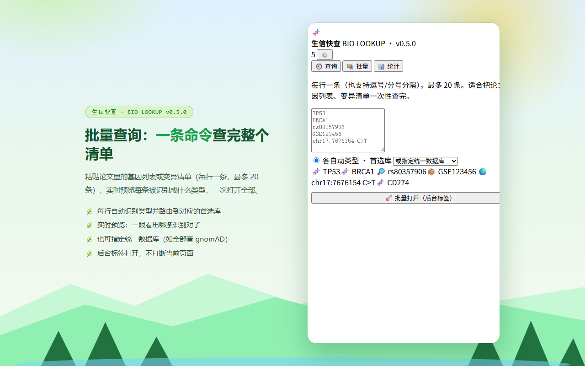

# Bio Lookup · 生信快查

[**中文**](README.md) | English


> Select a gene symbol, GEO accession, variant, rsID or PMID on any page → **right-click to jump to 15+ bioinformatics databases**.
> Smart type detection · **98 cancer-related gene quick-reference** · page scan · in-page gene highlighting · VCF batch annotation · sequence tools · query statistics.

A browser extension for Chrome / Edge (Manifest V3) · zero dependencies · zero build step · **light nature theme** · does not read pages by default · no tracking.

| 🔍 **Scan this page** (v0.6.0) | 🖍️ **In-page gene highlighting** (v0.6.0) |
|---|---|
|  |  |

| Query panel + gene info | Right-click menu | VCF batch annotation |
|---|---|---|
|  |  |  |

| Batch query | Statistics | In-page floating card |
|---|---|---|
|  |  |  |

---

## ⬇️ Install (30 seconds, no build required)

1. **Download** the latest release zip → [**Releases → latest**](https://github.com/sushuqiong/bio-lookup-extension/releases/latest)
   (file: `bio-lookup-extension-vX.Y.Z.zip`)
2. **Unzip** it to any folder you like
3. Open your browser:
   - Microsoft Edge → `edge://extensions`
   - Google Chrome → `chrome://extensions`
4. Turn on **Developer mode** (Edge: bottom-left sidebar; Chrome: top-right)
5. Click **Load unpacked** and select the **unzipped folder** (not the zip)

> Requires Chrome / Edge **116 or newer** (desktop).

### First test
Open any web page, select `BRCA1`, right-click → you should see **生信快查 · 🧬 基因「BRCA1」**.

---

## ✨ Features

### 🧠 Smart type detection (9 kinds)
| Kind | Examples | Primary databases |
|---|---|---|
| 🧬 Gene | `BRCA1` `TP53` `CD274` `miR-21` `HLA-DRA` | NCBI Gene · Ensembl · GeneCards · UniProt |
| 📦 GEO / SRA | `GSE123456` `GSM123456` | GEO · SRA Run Selector · ArrayExpress |
| 🔎 rsID | `rs80357906` | dbSNP · ClinVar · gnomAD · VarSome |
| 🧪 Variant (HGVS) | `NM_007294.4:c.68_69del` `p.Val600Glu` | ClinVar · gnomAD · VarSome · Franklin |
| 🌍 Variant (coords) | `chr17:7676154 C>T` | gnomAD · ClinVar · UCSC |
| 🧾 VCF row | `17 7676154 rs80357906 C T` | gnomAD · ClinVar · dbSNP |
| 🗺️ Region | `chr1:12345-12400` | UCSC · Ensembl |
| 📚 Literature | `PMID: 12345678` · DOI | PubMed · Europe PMC · Google Scholar · Zotero |
| 🚀 Sequence | ≥20 bp of `ACGT…` | NCBI BLAST |

The right-click menu **only lists databases relevant to what you selected** — unlike a fixed menu, no clutter.

### 🔍 Scan this page (new in v0.6.0)
One click extracts **every gene / rsID / variant / GEO accession / PMID / DOI** on the current page,
de-duplicates and counts them, then fills the batch panel so you can open them all at once.
Uses the `activeTab` permission — the page is read **only when you click the button**.

### 🖍️ In-page gene highlighting (optional, off by default)
Highlight known gene symbols / rsIDs / dataset IDs in any web page; click one to open the query card.
Only **high-confidence** targets from a local vocabulary (113 terms) are marked, capped at 150 per page.

### 🧬 Built-in quick-reference for 98 cancer-related genes
Select or type a gene and instantly see its **associated cancers and main pathway** — purely local data, no network calls:

| Gene | Cancers | Pathway |
|---|---|---|
| `BRCA1` | Breast · Ovarian · Prostate · Pancreatic | Homologous recombination repair (HRR) |
| `CD274` (PD-L1) | Pan-cancer immunotherapy marker · Lung · Gastric | Immune checkpoint |
| `CLDN18` | Gastric · Gastro-oesophageal junction | Adhesion / therapeutic target |
| `EGFR` | NSCLC · Colorectal · Glioblastoma | RTK / RAS / MAPK |

Covers targeted therapy, immune checkpoints, MMR/HRR pathways and chemo-sensitivity genes
(`DPYD`, `UGT1A1`, `TYMS`, …). Aliases supported: `HER2`→ERBB2, `PD-L1`→CD274, `p53`→TP53, `CLDN18.2`→CLDN18.

### 🧾 VCF batch annotation
Select a VCF block → normalize coordinates (all these become the gnomAD-compatible `17-7676154-C-T`):
`chr17:7676154 C>T` · `chr17:7676154C>T` · `17-7676154-C-T` · `chr17:g.7676154C>T`.
Then open gnomAD / ClinVar / VarSome for all rows, or export the normalized query list as CSV.

### 🔬 Sequence tools
Select a DNA sequence (≥4 bp) → length, GC content, reverse complement and RNA transcript, with one-click copy.

### 📊 Query statistics
Total / today / kinds / databases + type distribution bars + top-5 databases + frequent query cloud.

### 🕘 Query history
Every query is logged (term · type · database · time), searchable, filterable, click to re-run, exportable as CSV — useful for writing Methods or reviewing your own analysis.

### ⚙️ Custom databases
Add any database with a `{q}` URL template; restrict it to specific types; import/export the config.

### 📗 Zotero integration (optional)
`PMID` / `DOI` → search your **local** Zotero library → jump with `zotero://select`.
Requires Zotero 7 running with "Allow other applications to communicate".

### ⌨️ Keyboard shortcut
`Alt+Shift+B` → open the panel.

---

## 🔒 Privacy

- Default permissions: **`contextMenus`, `activeTab`, `storage`** — **no web page access** until you explicitly enable a feature.
- Page reading (floating card, highlighting, "scan this page") uses **optional permissions** you grant yourself, and `activeTab` for scanning (only on click).
- All data (history, settings, custom databases) stays in your browser's local storage. **Nothing is uploaded.**
- No analytics, no telemetry, no remote code.
- Privacy policy: <https://sushuqiong.github.io/bio-lookup-extension/privacy.html>

---

## 🧪 Tests

169 automated tests, all runnable offline (Node 18+):

```bash
node tests/classify.test.mjs          # 67 — type detection / VCF parsing / URL building
node tests/genedata.test.mjs          # 26 — gene table / aliases / sequence tools
node tests/scan.test.mjs              # 21 — page scanning / highlight vocabulary
node tests/background.sim.mjs         # 14 — background logic against a mocked Chrome API
node tests/background.bundle.sim.mjs  # 10 — single-file bundle behaviour
node tests/background.degraded.sim.mjs # 8 — graceful degradation when an API is missing
```

---

## 📁 Repository layout

```
manifest.json          # MV3 manifest
classify.js            # type detection + database map (pure functions)
genedata.js            # type colors + 98-gene table + sequence tools + page scanning
background.js          # source of the service worker
background.bundle.js   # generated single-file worker (no ESM) ← used by the extension
content.js             # floating card + in-page highlighting (injected on demand)
popup.html/css/js      # main panel (history / batch / statistics)
options.html/js        # settings (custom DBs, floating card, highlighting, menu repair)
build.py               # merges the three modules into background.bundle.js
tests/                 # 169 automated tests
docs/                  # GitHub Pages landing page + privacy policy + store screenshots
```

### Rebuild the background bundle

```bash
python build.py     # regenerates background.bundle.js from the three modules
```

---

## ⚠️ Known limitations

- Regex detection cannot reach zero false positives (`COVID`, `MISSING` may look like gene symbols; 7–9 digit numbers may look like PMIDs) — a generic search fallback is always appended to every menu.
- The floating card and highlighting do not work on `chrome://` pages, PDF viewers, the extension store, or inside VS Code / Zotero embedded browsers (browser restrictions).
- Batch and VCF operations are capped at 15–20 items to avoid opening dozens of tabs.
- Zotero integration requires a local Zotero instance.

---

## 📄 License

[MIT](LICENSE) © 2026 sushuqiong

## 💬 Feedback

Please use [GitHub Issues](https://github.com/sushuqiong/bio-lookup-extension/issues) — no email needed.
