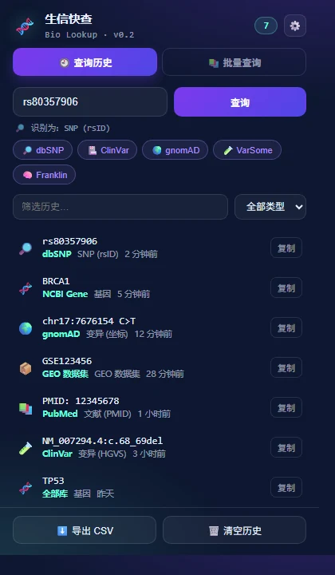
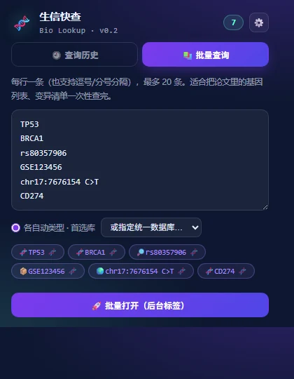

# 生信快查 · Bio Lookup

> 选中基因名 / GEO 编号 / 变异位点 / rsID / PMID，**右键一键跳转 15+ 生信数据库**——智能识别类型、VCF 批量注释、Zotero 联动、页面浮层、批量查询、可自定义数据库、自动留痕查询历史。

Chrome / Edge 浏览器扩展（Manifest V3）· 零依赖零构建 · 默认不读网页 · 无追踪





---

## 🆕 v0.3 新功能

### 🧾 VCF 批量注释（核心新功能）
在网页上**直接选中一段 VCF**（多行，含 `##` header 也没关系）→ 右键菜单变成 VCF 模式：

```
##fileformat=VCFv4.2
#CHROM  POS       ID          REF  ALT
17      7676154   rs80357906  C    T
chr1    12345     .           A    G
2       54321     .           G    A
```

菜单提供：
| 选项 | 行为 |
|---|---|
| 🌍 全部查 gnomAD | 每行按 `CHROM-POS-REF-ALT` 规范格式打开 gnomAD variant 页 |
| 🏥 全部查 ClinVar | 每行转 `17:7676154` 坐标 term 检索 |
| 🧪 全部查 VarSome | 同 gnomAD 规范格式（hg38） |
| 🚀 **智能路由** | 有 rsID 的走 dbSNP，其余走 gnomAD（**一条命令查完混合清单**） |
| ⬇️ 导出规范化查询词 | CSV（CHROM/POS/ID/REF/ALT/gnomAD_query/原行），便于留档或喂给别的工具 |

**关键点**：插件会把 VCF 字段**归一化**成各库能直接识别的格式——`chr17:7676154 C>T`、`chr17:7676154C>T`、`17-7676154-C-T` 三种写法都能转成 gnomAD 需要的 `17-7676154-C-T`。

### 📗 Zotero 联动
选中 `PMID: 12345678` 或 DOI → 右键「📗 在 Zotero 中查找」→ 调用**本机 Zotero API**（127.0.0.1:23119）搜索 → 命中则直接 `zotero://select` 跳转并选中该条目。

前置条件：Zotero 7 运行中 + `设置 → 高级 → 允许其他应用与本机 Zotero 通讯`；插件侧在设置页一键开启（`optional_host_permissions`，只访问本机回环地址）。

### 🐛 对抗性审查修复（v0.3 一并处理）

我做了一轮自审（前端视角），发现并修复：

| # | 问题 | 严重度 | 修复 |
|---|---|---|---|
| 1 | popup 里"全部打开"重查用 `setTimeout`，**popup 一关就中断**（只能开 1 个标签） | 🔴 | 改由 background 执行 |
| 2 | 导入自定义库**未校验 URL 协议**，恶意配置可注入 `javascript:` | 🔴 | 导入时强校验 `^https?://` + 跳过计数提示 |
| 3 | `onShown` 异步读 storage → 菜单可能闪烁/延迟 | 🟡 | 自定义库改内存缓存 + `storage.onChanged` 同步 |
| 4 | 开启浮层后**已打开的页面不生效**（动态注册只对新页面） | 🟡 | 开启时 `executeScript` 立即注入所有 http(s) 标签 |
| 5 | 识别误判无退路（如 `COVID` 被当基因） | 🟡 | 所有类型菜单末尾自动追加 **🔍 NCBI 全库检索 / Google Scholar** |
| 6 | 扩展重载后 content script `sendMessage` 静默失败 | 🟡 | `chrome.runtime.lastError` + try/catch 兜底 |
| 7 | 键盘用户无法唤起浮层 | 🟡 | 加 `Alt+Shift+B` 快捷键打开面板 |


---

## 🎯 创新点在哪里

同类插件（GeneLens、BioSearch、gnomAD 单库插件等，GitHub 上多为 ⭐0–3）普遍是**"一个功能 + 固定菜单"**：要么只认基因、要么菜单里塞满所有库让你自己找、要么没有历史。

Bio Lookup 的四个差异点：

| # | 创新 | 具体表现 | 对研究者的意义 |
|---|---|---|---|
| 1 | **先识别，再给菜单** | 正则引擎判别 9 类对象（基因 / GEO / rsID / HGVS / 坐标 / 区间 / PMID / DOI / 核酸序列），**右键菜单只列出与该类型相关的库** | 选中 rsID 时不会看到 UniProt 这种无关项，减少决策成本 |
| 2 | **一键全开（比对式查询）** | 一次点击并行打开最多 5 个相关库的**后台标签** | 变异解读要同时看 dbSNP + gnomAD 频率 + ClinVar 致病性——这是生信/临床的真实工作流，其他插件没有 |
| 3 | **批量查询** | 粘贴论文里的基因列表 / 变异清单（每行一条，最多 20 条），**按各自类型**自动路由到首选库 | 复现一篇论文的基因集、查一批候选变异，从 20 次手动操作变成 1 次 |
| 4 | **查询历史 + 可导出** | 记录查询词 / 识别类型 / 目标库 / 时间，可搜索、按类型筛选、点击重查、**导出 CSV** | 方法学与可追溯：写 Methods 或回看分析过程时能拿出"我查过哪些位点、用的哪个库" |

另外两点工程层面的克制：
- **权限最小化**：默认只申请 `contextMenus` + `storage`，**不读任何网页内容**；页面浮层是可选功能，开启时才通过 `optional_host_permissions` 申请
- **数据不出本地**：历史与自定义配置只存 `chrome.storage.local`，无服务器、无遥测

---

## ✨ 功能一览

| 功能 | 说明 |
|---|---|
| 🔍 智能类型识别 | 9 类对象正则判别，67 项单元测试（`node tests/classify.test.mjs`） |
| 🖱️ 动态右键菜单 | 菜单标题显示识别结果（如「🧬 基因「BRCA1」」），只列相关库 |
| 🚀 一键全开 | 单次查询并行打开 5 个相关库（后台标签，带限流） |
| 🎈 页面浮层 | **双击**任意网页上的基因/rsID/坐标 → 鼠标旁弹出查询卡片（Shadow DOM 隔离，不污染页面） |
| 📚 批量查询 | 粘贴多行清单 → 预览识别结果 → 一次打开；可按类型分组或指定统一库 |
| ⭐ 自定义数据库 | 用 `{q}` 模板添加自己的库（实验室镜像 / 公司内部系统 / 中文数据库），可指定适用类型，支持导入导出配置 |
| 🕘 查询历史 | 搜索 / 类型筛选 / 点击重查 / 复制 / **导出 CSV** |
| 🔢 徽章计数 | 图标显示今日查询次数 |

---

## 🚀 安装（Chrome / Edge）

### 方式一：Releases 下载（推荐）

1. 到 [Releases](https://github.com/sushuqiong/bio-lookup-extension/releases) 下载 `bio-lookup-extension-v0.2.0.zip` 并**解压**
2. Chrome 打开 `chrome://extensions`；**Edge 打开 `edge://extensions`**
3. 开启「**开发者模式**」
4. 点「**加载已解压的扩展程序**」→ 选择解压出的文件夹
5. 建议把图标固定到工具栏

> Edge 基于 Chromium，原生兼容，无需任何改动。

### 方式二：克隆源码

```bash
git clone https://github.com/sushuqiong/bio-lookup-extension.git
cd bio-lookup-extension
node tests/classify.test.mjs   # 跑识别引擎测试
# 然后按上面步骤 2-4 加载本目录
```

---

## 🖱️ 怎么用

### 1. 基础：右键查询
在任意网页选中文本（如 `BRCA1`）→ 右键 → 菜单顶部出现 **「生信快查 · 🧬 基因「BRCA1」」** → 展开选择数据库即可跳转。

### 2. 比对：一键全开
同一菜单里选 **「🚀 一键全开（6 个库 · 后台标签）」**——适合变异解读：dbSNP + gnomAD + ClinVar + VarSome 一次开好，逐个看。

### 3. 浮层：双击即查（可选，需授权）
设置页 → 打开「页面浮层」→ 在网页上**双击** `rs80357906` → 鼠标旁弹出卡片 → 点卡片上的库直接跳转。卡片用 Shadow DOM 实现，不会与页面样式打架。

### 4. 批量：清单式查询
点扩展图标 → **📚 批量查询** 标签 → 粘贴：
```
TP53
BRCA1
rs80357906
GSE123456
chr17:7676154 C>T
```
→ 预览区显示每条被识别成什么 → 选「各自动类型 · 首选库」或「指定统一数据库」→ **🚀 批量打开**（后台标签，最多 20 条）。

### 5. 自定义：接入你自己的库
点扩展图标右上 **⚙️** → 「添加自定义数据库」：
- 名称：`实验室 BLAST 镜像`
- URL 模板：`https://my-lab.org/blast?seq={q}`（`{q}` 会被替换成查询词并自动 URL 编码）
- 适用类型：Ctrl/Cmd 多选（不选=全部类型）

添加后会出现在**右键菜单和浮层卡片里**（排在官方库之后，标注"（自定义）"）。配置可导入导出，方便多台电脑同步。

### 6. 留痕：历史与导出
点图标 → **🕘 查询历史** → 搜索/筛选 → 点任意条目**重查** → 底部 **⬇️ 导出 CSV**（含查询词、类型、数据库、时间）。

---

## 🗄️ 内置数据库（15+）

| 类型 | 数据库 |
|---|---|
| 基因 | NCBI Gene · Ensembl · GeneCards · UniProt · NCBI Protein · PubMed |
| SNP (rsID) | dbSNP · ClinVar · gnomAD · VarSome · Franklin |
| 变异 (HGVS) | ClinVar · gnomAD · VarSome · Franklin |
| 变异 (坐标) | gnomAD · ClinVar · VarSome · UCSC |
| GEO / 数据集 | GEO · SRA Run Selector · ArrayExpress · PubMed |
| 文献 | PubMed · Europe PMC · Google Scholar · **Zotero（本机库）** |
| 区间 / 序列 | UCSC Genome Browser · Ensembl · NCBI BLAST |

## 🧠 识别规则示例

| 输入 | 识别为 |
|---|---|
| `BRCA1` `TP53` `miR-21` `let-7a` `HLA-DRA` `LINC00473` | 🧬 基因 |
| `GSE123456` `GSM1234567` `GPL570` | 📦 GEO 数据集 |
| `rs80357906` | 🔎 SNP (rsID) |
| `chr17:7676154 C>T` `17-7676154-C-T` | 🌍 变异 (坐标) |
| `NM_007294.4:c.68_69del` `p.Val600Glu` | 🧪 变异 (HGVS) |
| `chr1:12345-12400` | 🗺️ 基因组区间 |
| `PMID: 12345678` | 📚 文献 |
| `17	7676154	rs80357906	C	T` | 🧾 VCF 记录（自动归一化为 `rs80357906` 或 `17-7676154-C-T`） |
| `10.1038/s41586-020-2008-3` | 🔖 DOI |
| 20+ 位 `ATCGN` 串 | 🚀 核酸序列 |

---

## 🔐 权限说明

| 权限 | 用途 | 必需 |
|---|---|---|
| `contextMenus` | 显示右键菜单 | ✅ |
| `storage` | 本地保存历史与自定义配置 | ✅ |
| `scripting` | 动态注册/注销页面浮层脚本 | ✅（浮层用） |
| `optional_host_permissions`（http/https） | **仅在你开启页面浮层时**申请，用于注入浮层 | ❌ 默认不申请 |
| `optional_host_permissions`（127.0.0.1:23119） | **仅在你开启 Zotero 联动时**申请，只访问本机 Zotero API | ❌ 默认不申请 |

**无网络请求**（除你自己触发的数据库跳转）、**无遥测**、**不读网页内容**（除非你主动开启浮层）。

## 🛠️ 开发

```
bio-lookup-extension/
├── manifest.json          # MV3 配置（权限最小化 + optional host permissions）
├── classify.js            # 类型识别 + 数据库映射（纯函数，可单测）
├── background.js          # service worker：动态菜单 / 批量路由 / 消息接口 / 浮层注册
├── content.js             # 页面浮层（Shadow DOM 隔离）
├── popup.html/.css/.js    # 历史 + 批量查询面板
├── options.html/.js       # 设置：浮层开关 + 自定义数据库管理
├── icons/                 # 16/48/128
├── tests/                 # 识别引擎 / VCF / 归一化测试（67 项）
└── docs/                  # 演示图
```

改完代码后在 `chrome://extensions`（或 `edge://extensions`）点扩展卡片上的「刷新」图标即可生效。

## 🗺️ Roadmap

- [x] v0.1：智能识别 + 动态菜单 + 全开 + 历史
- [x] v0.2：页面浮层 + 批量查询 + 自定义数据库 + CSV 导出
- [x] v0.3：**VCF 批量注释**（字段解析 + 坐标归一化 + 智能路由 + CSV 导出）、**Zotero 联动**（本机 API 搜索 + 跳转选中）、7 项对抗性审查修复
- [ ] v0.4：i18n（English UI）、商店上架（Edge Add-ons / Chrome Web Store）
- [ ] v1.0：支持多基因组合查询、与实验室 LIMS / 内部数据库对接

## 📄 License

MIT © sushuqiong
